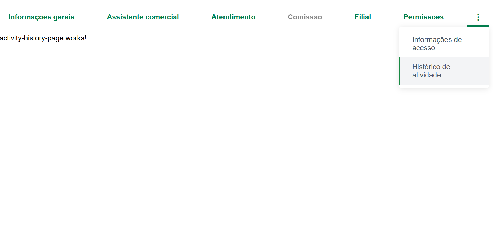

# **Responsive Tabs in Angular with PrimeNG**

Este projeto tem como objetivo demonstrar e compartilhar um componente de **tabs responsivas**, utilizando **Angular** e **PrimeNG**. O componente oferece uma interface intuitiva e funcional, adaptando-se automaticamente ao tamanho da tela, garantindo uma ótima experiência de uso em dispositivos móveis e desktop.



## **Recursos**

- **Responsividade**: O componente se adapta a diferentes tamanhos de tela, garantindo uma boa experiência de uso em dispositivos móveis e desktop.
- **Customização**: Fácil personalização de estilos e comportamento para atender às suas necessidades específicas.
- **Integração com PrimeNG**: Utiliza o PrimeNG para uma interface rica e interativa com ícones e animações suaves.
- **Simples e eficiente**: A implementação do componente de tabs é simples e pode ser facilmente integrada em qualquer projeto Angular.

## **Instalação**

1. Clone o repositório:

   ```bash
   git clone https://github.com/seu-usuario/responsive-tabs-angular-with-primeng.git
   ```

2. Navegue até o diretório do projeto:

   ```bash
   cd responsive-tabs-angular-with-primeng
   ```

3. Instale as dependências:

   ```bash
   npm install
   ```

4. Execute o aplicativo localmente:

   ```bash
   ng serve
   ```

   O aplicativo estará disponível em [http://localhost:4200](http://localhost:4200).

## **Deploy**

Você pode visualizar o componente funcionando em tempo real no [Vercel](https://responsive-tabs-angular-with-primeng.vercel.app/).

## **Contribuições**

Contribuições são bem-vindas! Se você tiver melhorias, correções ou sugestões, sinta-se à vontade para abrir um **pull request**.
